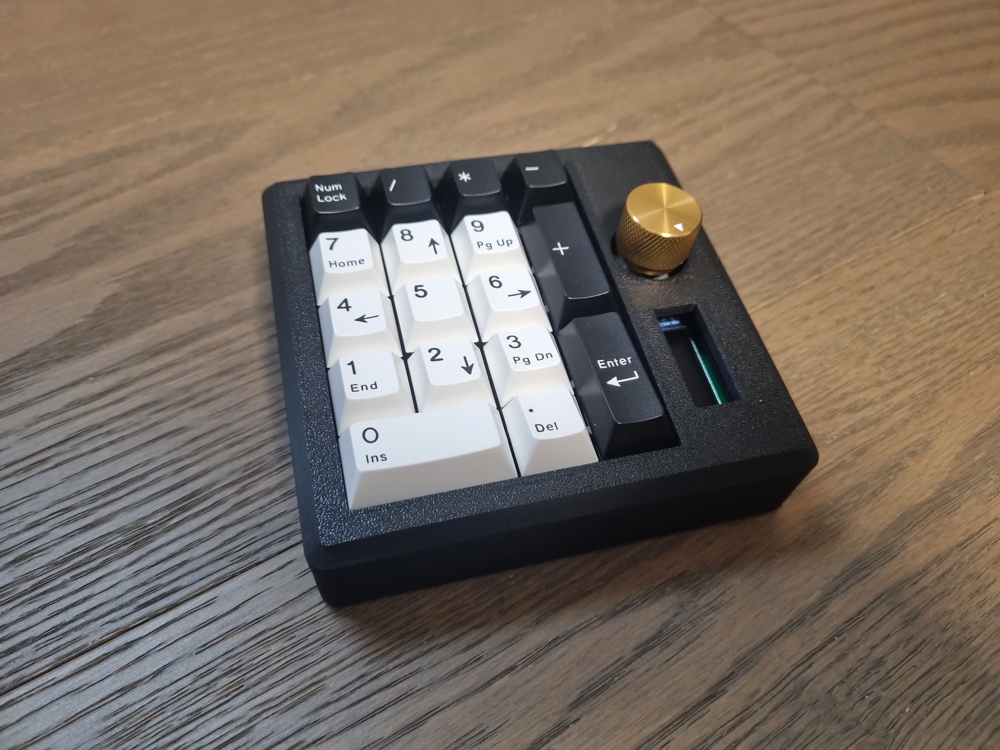
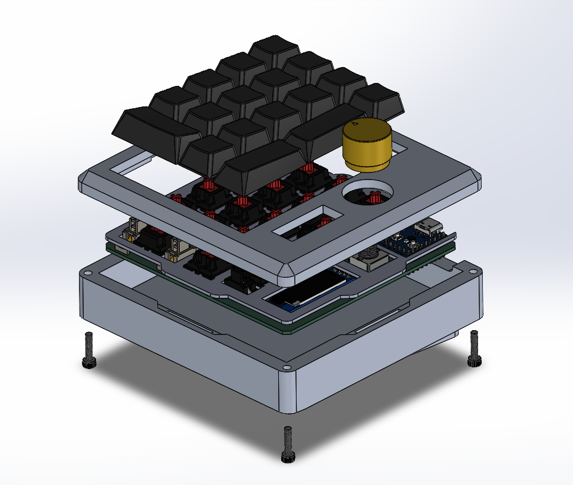
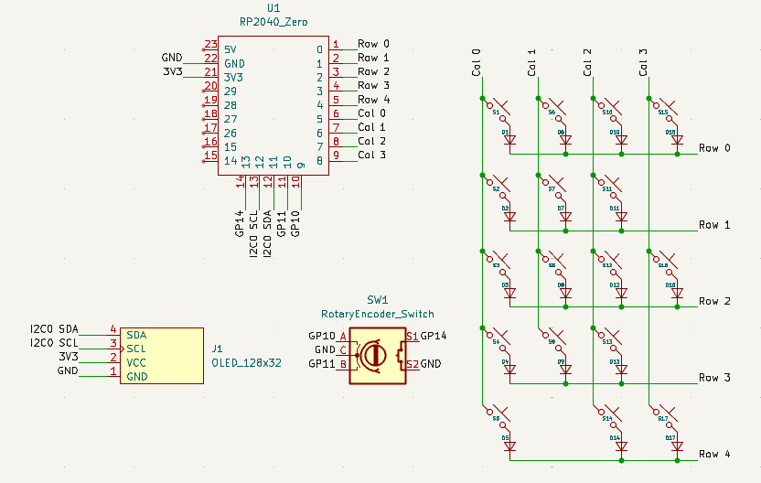
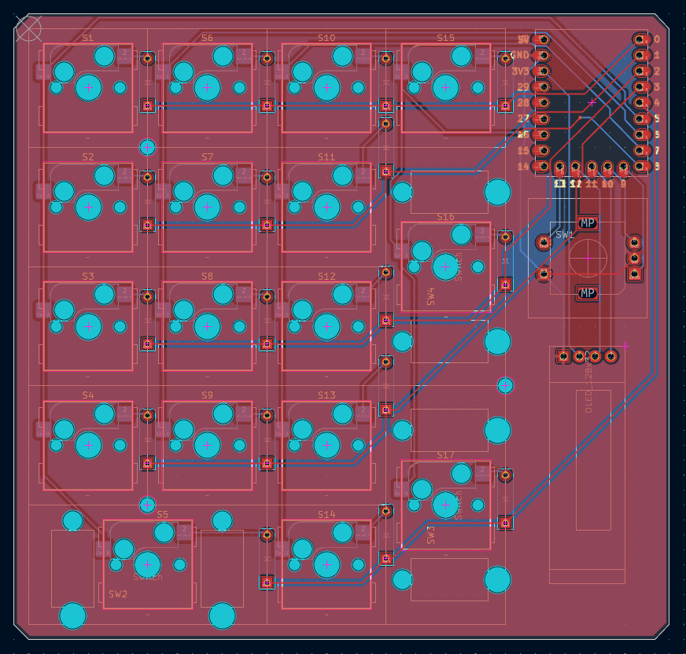

# Numpad-Projectv1

This project is an RP2040-powered gasket-mount numpad with a rotary encoder and OLED display, intended to help me learn introductory PCB design and QMK firmware. 

  

## Mechanical

  

The top case, bottom case, and plate were designed in SolidWorks and 3D-printed. 

## Electrical

  
  

Schematic and PCB were designed in KiCad and sent to be manufactured by JLCPCB. 

## Assembly

1. Solder RP2040 Zero, 1N4148 diodes, MX hotswap sockets, EC11 rotary encoder, 128X32 OLED display onto PCB
2. Add 3 2U screw-in stabilizers (1.6mm) to the PCB
3. Attach plate to PCB using 3mm standoffs and M2 x 3mm screws
4. Insert 17 MX switches into the assembly
5. Add 8 (4 on top case, 4 on bottom case) 3mm x 25mm x 1.5mm gaskets to the cases
6. Sandwich the plate between the top and bottom cases, and assemble using 4 M3 x 12mm screws
7. Add rubber feet (or tack) to the bottom case
8. Add keycaps and knob

Done!
